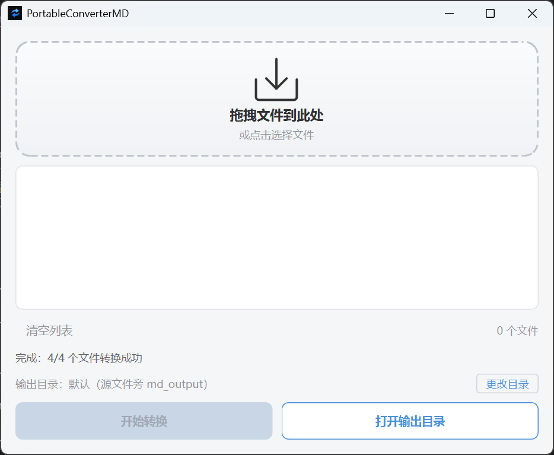

<h1 align="center">PortableConverterMD</h1>

<p align="center">
  
  
  
  
</p>

<p align="center">
  拖拽文件 → 一键转 Markdown<br>
  基于 <a href="https://github.com/microsoft/markitdown">Microsoft MarkItDown</a> 的 Windows 桌面工具
</p>

---

## 下载

| 版本 | 说明 |
|---|---|
| [PortableConverterMD-Setup.exe]() | 安装包（推荐）— 开始菜单、右键菜单、桌面快捷方式 |
| [PortableConverterMD.zip]() | 绿色免安装版 — 解压即用 |

---

## 特性

- **拖拽即用** — 拖入文件或点击选择，批量转换
- **全格式覆盖** — Office（Word/Excel/PPT）、PDF、图片、HTML、CSV、JSON、XML、音频、ZIP
- **扫描件 OCR** — 内置 Tesseract，扫描版 PDF 自动识别文字（中英双语）
- **后台转换** — 多线程处理，实时显示当前处理文件及状态
- **右键菜单** — 安装后右键任意文件直接转换为 Markdown
- **自定义输出** — 可指定输出目录，默认输出到源文件旁 `md_output`
- **可配日志** — `settings.json` 控制日志开关，日志文件可选查看

## 界面

<p align="center">
  
</p>

## 使用

```bash
pip install -r requirements.txt
python main.py
```

支持命令行模式：

```bash
PortableConverterMD.exe "C:\path\to\file.pdf"
```

## 打包

```bash
# 绿色免安装版
pyinstaller portable_converter_md.spec

# 安装包（需要 Inno Setup）
# 用 Inno Setup 打开 setup.iss 编译
```

## 项目结构

```
├── main.py                          # 入口（GUI + CLI）
├── converter.py                     # 转换引擎 + OCR
├── worker.py                        # 后台线程
├── ui.py                            # GUI 界面
├── test_converter.py                # 单元测试
├── requirements.txt                 # Python 依赖
├── portable_converter_md.spec       # PyInstaller 配置
├── setup.iss                        # Inno Setup 配置
├── add_context_menu.reg             # 右键菜单注册表
├── settings.json                    # 应用设置
├── PortableConverterMD.png          # 应用图标
├── screenshot.png                   # 界面截图
├── tesseract/                       # OCR 引擎（内置）
└── docs/                            # 设计文档
```

## 依赖

| 包 | 用途 |
|---|---|
| [markitdown](https://github.com/microsoft/markitdown) | 文件 → Markdown 核心引擎 |
| [PySide6](https://pypi.org/project/PySide6/) | Qt 桌面框架 |
| [Tesseract-OCR](https://github.com/UB-Mannheim/tesseract) | 扫描件 PDF 文字识别（内置） |
| [pyinstaller](https://pyinstaller.org/) | 打包为独立程序 |

## 许可证

MIT
