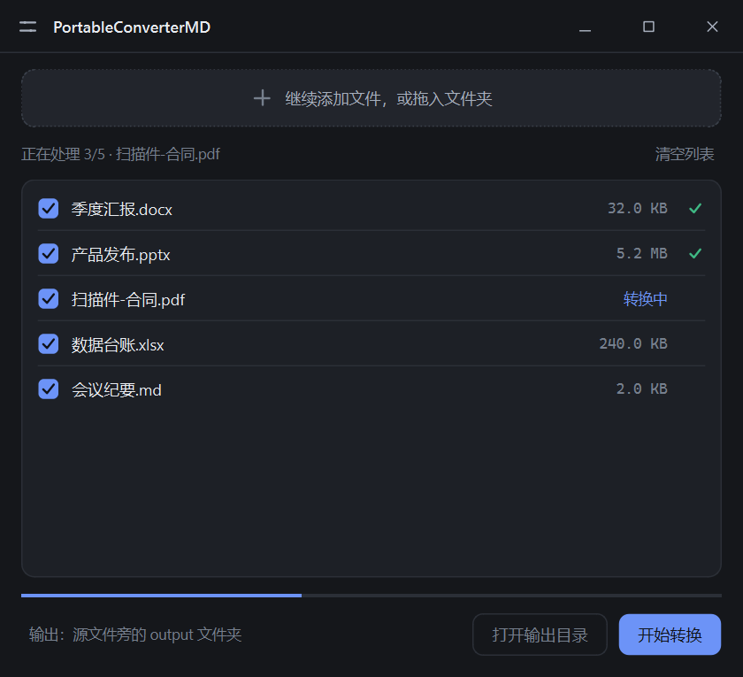
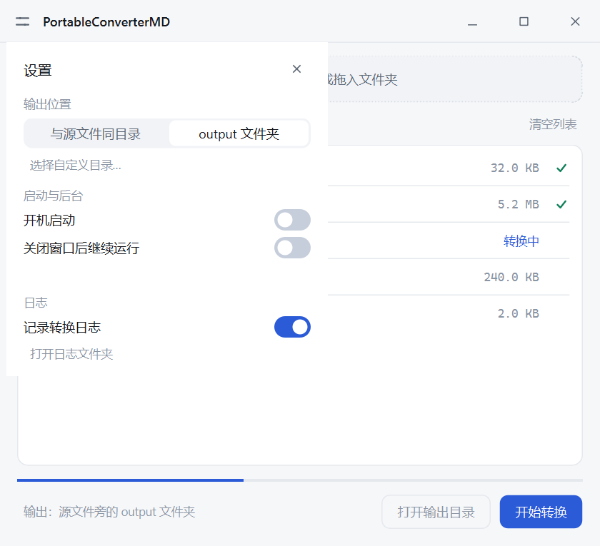

<p align="center">
  
  
  
  
  
</p>

<h1 align="center">PortableConverterMD</h1>

<p align="center">
  <strong>拖拽文件，一键转 Markdown</strong><br><br>
  一个 Windows 桌面工具，把 Office 文档、PDF、图片、网页等批量转换为 Markdown<br>
  扫描件走 <strong>Windows 内置 OCR</strong>，无需额外下载引擎
</p>

<p align="center">
  
  
  
</p>

## 特性

- **拖拽即用** — 拖入文件或整个文件夹，批量转换；`Delete` 移除选中项，空格切换勾选
- **格式覆盖** — Word / Excel / PPT、PDF、图片（OCR）、HTML、CSV、JSON、XML、ZIP
- **扫描件 OCR** — 使用系统自带的 Windows OCR：不用下载引擎、不用装语言包以外的依赖；
  PDF 只对**没有文本层的页**做识别，多页并行
- **输出位置可选** — 与源文件同目录 / 源文件旁 `output` 文件夹 / 自定义目录
- **设置面板** — 标题栏左上角齿轮：输出位置、开机启动、关闭窗口后继续在后台（托盘）运行、日志开关
- **轻快** — 安装体积约 87 MB（历史版本 717 MB）；小文件单次转换约 0.3–0.5 秒
- **紧凑自适应界面** — 空态是一整块投放区，有文件后自动收成一条细带；行高 34px，
  等宽数字对齐，跟随系统浅色/深色；自绘标题栏保留系统投影与圆角
- **右键菜单** — 安装后右键支持的文件类型才有「转换为 Markdown」，多选可一次转换
- **实时状态** — 逐行显示进度：转换中 / 成功 ✓ / 失败 ✕（悬停可看错误原因）
- **输出安全** — 同名结果不覆盖，自动加序号；转换失败不产生空文件
- **命令行 / 右键** — 支持传文件路径直接转换，无需打开 GUI

## 支持格式

| 类别 | 扩展名 |
|---|---|
| 文本 / 数据 | `.txt` `.md` `.log` `.ini` `.cfg` `.yaml` `.yml` `.py` `.csv` `.tsv` `.json` `.xml` |
| 网页 | `.html` `.htm` |
| Office | `.docx` `.xlsx` `.pptx` |
| PDF | `.pdf`（文本层优先，扫描页自动 OCR） |
| 图片（OCR） | `.png` `.jpg` `.jpeg` `.bmp` `.tif` `.tiff` `.webp` `.gif` |
| 压缩包 | `.zip`（递归转换其中的可识别文件） |

> 旧版 `.doc` `.xls` `.ppt`（97-2003 二进制格式）与音频转写不在支持范围。

## 环境要求

- Windows 10 1809 及以上（Windows OCR 依赖 `Windows.Media.Ocr`）
- OCR 语言取决于系统已安装的语言功能；中文需在
  **设置 → 时间和语言 → 语言和区域 → 语言功能 → 光学字符识别（OCR）** 中安装

## 安装

从 [Releases]() 下载安装包，双击安装；或下载绿色免安装版，解压即用。

## 使用

### GUI 模式

启动后拖入文件 → 勾选需要的 → 点「开始转换」。

### 设置（标题栏左上角齿轮）

| 设置项 | 说明 |
|---|---|
| 输出位置 | **与源文件同目录**：`report.docx` → `report.md`（同一目录）<br>**output 文件夹**：`report.docx` → `output\report.md`（默认）<br>也可指定固定的自定义目录（优先级最高） |
| 开机启动 | 写入 `HKCU\...\CurrentVersion\Run`，随 Windows 登录自动启动 |
| 关闭窗口后继续运行 | 打开后关闭窗口只是隐藏到系统托盘；托盘菜单可「显示主窗口 / 设置 / 退出」 |
| 记录转换日志 | 关闭后不再写日志文件；日志位于 `%LOCALAPPDATA%\PortableConverterMD\logs` |

### 右键菜单

安装时勾选「添加右键菜单」，之后在支持的文件上右键 → **转换为 Markdown**。
菜单**按文件类型注册**（`SystemFileAssociations\<.ext>`），不支持的类型不会出现这一项；
多选文件时只调用一次程序并一次性全部转换。若通过命令行/拖拽传入了不支持的类型，
程序会跳过并给出提示，而不是抛一堆转换错误。

### 命令行

```bash
PortableConverterMD.exe "C:\path\to\file.pdf"
PortableConverterMD.exe "a.docx" "b.xlsx" "扫描件.pdf"
```

命令行/右键转换同样遵循「设置」里的输出位置（同目录 / output 文件夹 / 自定义目录）。

## 从源码运行

```bash
git clone https://github.com/your-org/PortableConverterMD.git
cd PortableConverterMD

python -m venv .venv
.venv\Scripts\python -m pip install -r requirements.txt

.venv\Scripts\python main.py
```

运行测试：

```bash
.venv\Scripts\python -m pytest -q
```

## 打包

```bash
# 绿色免安装版（onedir），务必用项目自己的 venv，避免全局环境的杂包被扫进去
.venv\Scripts\python -m PyInstaller --noconfirm portable_converter_md.spec

# 安装包（需要 Inno Setup）
# 用 Inno Setup 打开 setup.iss → 编译
```

## 原理

```
拖拽 / 右键 / 命令行
   └─ engine.convert_to_text()
        ├─ 按扩展名分发（不做 ML 类型嗅探）
        ├─ 文本 / 数据 / 网页 / Office → 对应库直接抽取
        ├─ PDF → 逐页取文本层 → 有文本直接用
        │                     └─ 无文本页 → 渲染 → Windows OCR（并行）
        ├─ 图片 → Windows OCR
        └─ ZIP  → 递归（含 zip-slip / 体积保护）
   └─ 先转换成功，再原子写盘（失败不留 0 字节文件）
```

OCR 后端优先级：**Windows 内置 OCR** → 若程序目录下存在 `tesseract\tesseract.exe` 则回退到它
（用 subprocess 调用，因此不需要 `pytesseract` 及其 pandas 依赖）。

## 性能（本机实测，2026-09）

| 指标 | v1（markitdown 版） | v2（当前） |
|---|---|---|
| 安装体积 / 文件数 | 717.4 MB / 8884 | **87.3 MB / 156** |
| 启动到窗口 | 1.43 s（冷）/ 0.62 s | 1.09 s（最快）/ 1.10 s（中位） |
| txt → md（含启动） | 2.7 s | **0.40 s** |
| docx / xlsx / pptx | 2.6 / 2.8 / 2.6 s | **0.51 / 0.62 / 0.48 s** |
| 5 页文本 PDF | 2.7 s | **0.45 s** |
| 2 页扫描 PDF（OCR） | 5.8 s | **0.86 s** |
| 图片 OCR | 2.6 s 且输出空文件 | **0.69 s 且输出真实文字** |
| 首次转换固定导入开销 | 8.1 s（冷）/ 1.8 s（温） | ~0（按格式懒加载） |
| 批量 10 个文件（含 3 个 OCR） | — | **1.61 s 总计** |

> 关于启动：本机「空白窗口」地板值约 0.45 s（Qt + DWM 初始化），自绘界面树再占约 0.5 s，
> 打包解包约 0.25 s。为视觉质量（自绘行、圆角卡片、暗色主题）付出的这部分开销是刻意取舍；
> 若更看重启动速度，可减少界面控件数量回到 ~0.7 s。

设计取舍与完整测量过程见 [docs/architecture-review-v2-2026-09-25.md](docs/architecture-review-v2-2026-09-25.md)。

## 项目结构

```
├── main.py                     # 入口（GUI + 命令行/右键，含文件类型判定）
├── theme.py                    # 设计令牌与主题（颜色/字号/圆角/QSS、系统暗色、窗口投影）
├── widgets.py                  # 自绘控件（开关、分段控件、标题栏）
├── settings.py                 # 用户设置（输出位置/开机启动/后台常驻/日志）
├── settings_panel.py           # 设置面板浮层
├── ui.py                       # 界面：自绘文件行、自适应拖放区、完成弹窗、托盘
├── worker.py                   # 后台转换线程（带行号的信号，异常也不会卡死 UI）
├── converter.py                # 门面：应用路径、日志、转换入口
├── engine.py                   # 格式引擎：扩展名分发 + 每格式懒加载 + PDF 策略
├── ocr.py                      # OCR 后端：Windows OCR（主）/ Tesseract（可选回退）
├── test_converter.py           # 引擎测试（全格式、命名、错误路径）
├── test_ocr.py                 # OCR 清理与集成测试
├── test_settings.py            # 设置与安装脚本一致性测试
├── test_ui_worker.py           # 界面 + 线程集成测试（勾选/删除/文件夹/标题栏/设置面板）
├── conftest.py                 # 固定 Qt 加载顺序 + 隔离测试用 QSettings
├── requirements.txt            # 依赖白名单
├── portable_converter_md.spec  # PyInstaller 配置
├── setup.iss                   # Inno Setup 安装包配置（按文件类型注册右键）
├── res/                        # 图标、截图
└── docs/                       # 设计文档与架构复核
```

## 致谢

| 项目 | 用途 | 许可证 |
|------|------|--------|
| [PySide6](https://pypi.org/project/PySide6/) | GUI 框架 | LGPL |
| [pypdfium2](https://github.com/pypdfium2-team/pypdfium2) | PDF 渲染与文本层提取 | Apache 2.0 / BSD |
| [Pillow](https://python-pillow.org/) | 图像处理 | MIT-CMU |
| [python-docx](https://github.com/python-openxml/python-docx) / [openpyxl](https://openpyxl.readthedocs.io/) / [python-pptx](https://python-pptx.readthedocs.io/) | Office 文档解析 | MIT |
| [markdownify](https://github.com/matthewwithanm/python-markdownify) / [BeautifulSoup](https://www.crummy.com/software/BeautifulSoup/) / [lxml](https://lxml.de/) | HTML 转换 | MIT / Apache 2.0 |
| Windows OCR（系统组件） | 扫描件文字识别 | — |

> 早期版本使用的 MarkItDown 与内置 Tesseract 已在 v2 中移除（体积与启动开销，见架构复核文档）；
> Tesseract 仍可作为可选回退（自行放置 `tesseract\` 目录）。

## 许可证

[MIT](LICENSE)
